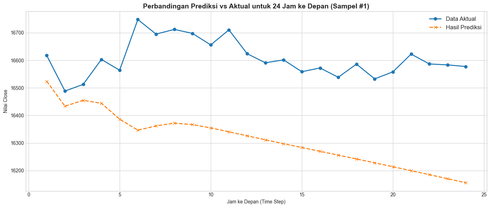
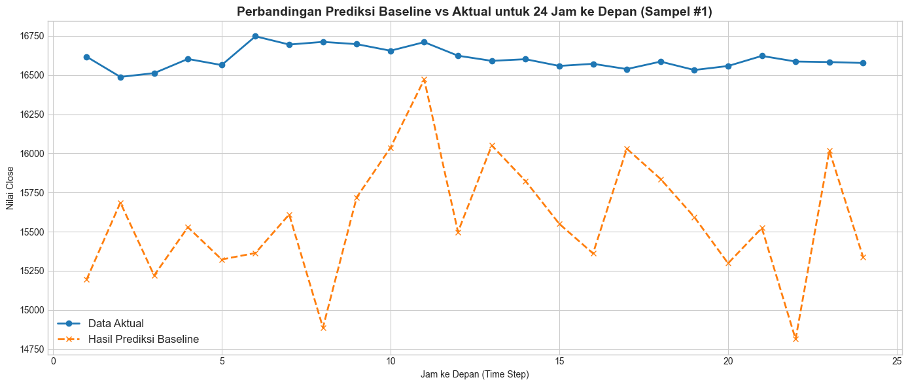

# Deep Learning Time Series — Multivariate Seq2Seq LSTM Forecasting

<div align="center">


**Proyek prediksi runtun waktu (time series) multivariat menggunakan arsitektur Encoder-Decoder Seq2Seq LSTM dengan teknik Teacher Forcing, Custom Training Loop (`tf.GradientTape`), dan Autoregressive Inference.**

[Deskripsi](#deskripsi-proyek) •
[Dataset](#dataset--feature-engineering) •
[Arsitektur](#arsitektur-model) •
[Hasil Inferensi](#hasil-inferensi--evaluasi) •
[Cara Penggunaan](#cara-penggunaan)

</div>

---

## Deskripsi Proyek

Prediksi runtun waktu (*time series forecasting*) merupakan salah satu permasalahan mendasar di bidang keuangan, meteorologi, dan manajemen sumber daya. Proyek ini membangun model **Deep Learning** tingkat lanjut yang mampu memprediksi pergerakan harga **Bitcoin (BTC/USDT)** secara multi-langkah (*multi-step forecasting*).

Berbeda dengan pendekatan konvensional yang hanya memprediksi **1 langkah** ke depan, model dalam proyek ini dirancang untuk memprediksi **24 langkah (jam) ke depan** berdasarkan riwayat historis **48 langkah (jam)** sebelumnya. Untuk mencapai akurasi tinggi pada prediksi multi-langkah, diimplementasikan arsitektur **Sequence-to-Sequence (Seq2Seq)** berbasis LSTM.

### Mengapa Seq2Seq?

Pada prediksi multi-langkah konvensional, model langsung memetakan input ke seluruh output horizon sekaligus menggunakan *Dense* layer. Pendekatan ini kurang efektif karena tidak memodelkan **ketergantungan antar langkah prediksi**. Arsitektur Seq2Seq mengatasi masalah ini dengan memisahkan proses menjadi dua tahap:

1. **Encoder**: Merangkum konteks historis menjadi *context vector*.
2. **Decoder**: Memprediksi output selangkah demi selangkah secara iteratif, di mana setiap langkah bergantung pada langkah sebelumnya.

### Fitur Teknis Utama

| Teknik | Implementasi | Tujuan |
|--------|-------------|--------|
| **Multivariate Input** | 8 fitur teknikal (Close, Volume, RSI, MACD, ATR, KAMAO, Rolling Stats) | Memberikan konteks pasar yang lebih kaya kepada model |
| **Keras Model Subclassing** | Class `Encoder`, `Decoder`, `Seq2SeqModel` | Fleksibilitas arsitektur kompleks yang tidak bisa dilakukan dengan Sequential/Functional API |
| **Custom Layer** | `CustomDense`, `CustomLeakyReLU`, `CustomMultiHeadAttention` | Implementasi manual layer dari scratch untuk pemahaman mendalam |
| **Teacher Forcing** | Input Decoder = shifted ground truth saat training | Mempercepat konvergensi dan menstabilkan training |
| **Autoregressive Inference** | Output langkah ke-t menjadi input langkah ke-(t+1) | Menyimulasikan skenario dunia nyata tanpa kebocoran data |
| **Custom Training Loop** | `tf.GradientTape` | Kontrol penuh atas proses forward pass, loss computation, dan backpropagation |
| **Custom Callbacks** | `CustomEarlyStopping`, `CustomReduceLROnPlateau` | Implementasi manual mekanisme early stopping dan learning rate scheduling |
| **Weighted MAE Loss** | Bobot linear 1.0 → 2.0 sepanjang horizon | Memberikan penalti lebih besar pada langkah prediksi yang lebih jauh (lebih sulit) |

---

## Dataset & Feature Engineering

### Informasi Dataset

| Informasi | Deskripsi |
|-----------|-----------|
| **Aset** | Bitcoin (BTC/USDT) |
| **Periode** | 21 September 2017 — 19 Oktober 2023 |
| **Interval** | Per Jam (*hourly*) |
| **Total Data** | 53.150 baris |
| **File** | `Bitcoin3.csv` |

### Statistik Deskriptif Fitur Utama

| Fitur | Mean | Std | Min | Max |
|-------|------|-----|-----|-----|
| **Close** | $20,595 | $15,822 | $3,172 | $68,633 |
| **Volume USDT** | $69.2M | $105.9M | $0 | $3.0B |
| **RSI** | 50.40 | 3.21 | 35.17 | 64.65 |
| **MACD Histogram** | 0.52 | 353.29 | -1,885.69 | 1,430.40 |
| **ATR** | 221.73 | 208.40 | 17.43 | 1,004.53 |

### Feature Engineering

Selain 6 fitur asli dari dataset, ditambahkan 2 fitur *rolling statistics* untuk membantu model menangkap tren lokal:

| No | Fitur | Tipe | Deskripsi |
|----|-------|------|-----------|
| 1 | `Close` | Harga | Harga penutupan BTC/USDT |
| 2 | `Volume USDT` | Volume | Volume transaksi dalam USDT |
| 3 | `RSI` | Momentum | Relative Strength Index — mengukur kekuatan tren |
| 4 | `MACD_Hist` | Momentum | Histogram MACD — sinyal perubahan arah tren |
| 5 | `ATR` | Volatilitas | Average True Range — mengukur volatilitas pasar |
| 6 | `KAMAO` | Moving Average | Kaufman Adaptive Moving Average Oscillator |
| 7 | `Rolling_Mean_24` | Rolling | Rata-rata bergerak 24 jam terakhir |
| 8 | `Rolling_Std_24` | Rolling | Standar deviasi bergerak 24 jam terakhir |

### Analisis Eksplorasi Data (EDA)

Sebelum pemodelan, dilakukan analisis mendalam terhadap karakteristik data:

1. **Dekomposisi Time Series**: Memisahkan komponen *trend*, *seasonality*, dan *residual*.
2. **Analisis ACF & PACF**: Menentukan *window size* optimal. Hasil analisis menunjukkan autokorelasi signifikan hingga **lag 48**, yang menjadi dasar pemilihan *window size* = 48.
3. **Heatmap Korelasi**: Mengidentifikasi hubungan antar fitur untuk validasi *feature engineering*.

### Data Splitting & Normalisasi

| Split | Proporsi | Jumlah Data | Fungsi |
|-------|----------|-------------|--------|
| **Train** | 70% | 37.188 | Pelatihan model |
| **Validation** | 15% | 7.969 | Monitoring *overfitting* & tuning |
| **Test** | 15% | 7.970 | Evaluasi akhir (tidak pernah dilihat model) |

Normalisasi dilakukan menggunakan **MinMaxScaler** yang di-*fit* hanya pada data training untuk mencegah *data leakage*.

### Time Series Windowing

Data sekuensial diproses ke dalam matriks 3D `[batch_size, time_steps, features]` menggunakan pipeline `tf.data.Dataset`:

| Parameter | Nilai | Keterangan |
|-----------|-------|------------|
| **Window Size (Input)** | 48 jam | Berdasarkan analisis ACF/PACF |
| **Forecast Horizon (Output)** | 24 jam | Target prediksi ke depan |
| **Batch Size** | 128 | Ukuran mini-batch untuk training |
| **Pipeline** | `shuffle(1024)` → `batch(128)` → `prefetch(AUTOTUNE)` | Optimasi performa I/O |

---

## Arsitektur Model

Proyek ini membandingkan **dua arsitektur** untuk menunjukkan keunggulan pendekatan Seq2Seq:

### 1. Baseline LSTM (Pembanding)

Arsitektur standar yang memetakan input langsung ke seluruh output horizon:

```
Input (48, 8) → LSTM(64, return_seq=True) → CustomMultiHeadAttention(2 heads)
             → LSTM(64) → BatchNorm → Dropout(0.2)
             → CustomDense(64, LeakyReLU) → BatchNorm → Dropout(0.2)
             → CustomDense(24) → Output (24,)
```

- **Training**: 15 epoch, optimizer Adam, loss MSE
- **Kelebihan**: Sederhana dan cepat
- **Kelemahan**: Tidak memodelkan ketergantungan antar langkah prediksi

### 2. Seq2Seq LSTM dengan Teacher Forcing (Model Utama)

Arsitektur *Encoder-Decoder* yang diimplementasikan menggunakan **Keras Model Subclassing**:

```
┌─────────────────────────────────────────────────────────────────┐
│                        ENCODER                                   │
│  Input (48, 8) → LSTM(64, return_sequences=True, return_state)  │
│  Output: enc_outputs, hidden_state (h), cell_state (c)          │
├─────────────────────────────────────────────────────────────────┤
│                   Context Vector                                 │
│  [hidden_state, cell_state] diteruskan ke Decoder               │
├─────────────────────────────────────────────────────────────────┤
│                        DECODER                                   │
│  Input: dec_input (1,1) + initial_state dari Encoder            │
│  → LSTM(64, return_sequences=True, return_state)                │
│  → Bahdanau Attention (query=dec_output, values=enc_outputs)    │
│  → Concat(dec_output, context) → Dense(1)                       │
│  Output: prediksi 1 langkah + updated states                    │
│                                                                  │
│  [Diulang 24 kali untuk menghasilkan 24 langkah prediksi]       │
└─────────────────────────────────────────────────────────────────┘
```

#### Mekanisme Training vs Inference

| Aspek | Training (Teacher Forcing) | Inference (Autoregressive) |
|-------|---------------------------|---------------------------|
| **Input Decoder** | *Shifted ground truth* (target aktual geser 1 langkah) | Hasil prediksi langkah sebelumnya |
| **Risiko** | *Exposure bias* | *Error accumulation* |
| **Keuntungan** | Konvergensi cepat & stabil | Simulasi skenario dunia nyata |

### Detail Custom Training Loop

Training model Seq2Seq dilakukan menggunakan **`tf.GradientTape`** alih-alih `model.fit()` standar untuk kontrol penuh:

| Konfigurasi | Nilai |
|-------------|-------|
| **Epochs** | 30 |
| **Optimizer** | Adam (lr = 1e-3) |
| **Loss Function** | Custom Weighted MAE (bobot linear 1.0 → 2.0) |
| **Early Stopping** | Patience = 5 (custom implementation) |
| **LR Reduction** | Factor = 0.5, Patience = 3, Min LR = 1e-6 (custom) |
| **Model Checkpoint** | Menyimpan model terbaik berdasarkan `val_loss` |

---

## Hasil Inferensi & Evaluasi

Evaluasi dilakukan secara ketat menggunakan metode inferensi **Autoregresif** pada data test yang tidak pernah dilihat model selama training maupun validasi. Hasil prediksi kemudian di-*denormalisasi* kembali ke skala harga asli (USD).

### Tabel Komparasi Performa Model

| Metrik Evaluasi | Baseline LSTM | Seq2Seq LSTM | Peningkatan |
|-----------------|---------------|--------------|-------------|
| **MAE (skala asli)** | $852.51 | **$353.29** | **~58.5% lebih akurat** |
| **RMSE (skala asli)** | $1,038.34 | **$507.19** | **~51.1% lebih stabil** |
| *MAE (skala normalisasi)* | *0.01302* | *0.00540* | *~58.5%* |

### Visualisasi Hasil Inferensi

#### Prediksi Seq2Seq LSTM (Model Utama)



Grafik di atas menunjukkan perbandingan **Data Aktual** (garis biru) dengan **Hasil Prediksi Seq2Seq** (garis oranye putus-putus) untuk 24 jam ke depan pada sampel data test. Model Seq2Seq berhasil menangkap **arah tren** dengan baik — keduanya menunjukkan tren penurunan yang konsisten. Meskipun terdapat selisih absolut antara prediksi dan aktual, **pola pergerakan** yang diprediksi sangat mendekati realita. Deviasi terbesar terjadi pada jam ke-6 hingga ke-10, yang merupakan area volatilitas tinggi.

#### Prediksi Baseline LSTM (Pembanding)



Sebagai perbandingan, grafik Baseline LSTM menunjukkan performa yang jauh lebih buruk. Prediksi Baseline (garis oranye putus-putus) berosilasi secara tidak menentu dan **gagal menangkap arah tren** yang sebenarnya relatif stabil. Fluktuasi prediksi yang tajam (terutama pada jam ke-8 hingga ke-12 dan jam ke-20 hingga ke-24) menunjukkan bahwa model Baseline tidak mampu memodelkan ketergantungan antar langkah prediksi — inilah kelemahan utama pendekatan *direct multi-step* dibandingkan *iterative Seq2Seq*.

### Analisis Perbandingan

| Aspek | Seq2Seq LSTM | Baseline LSTM |
|-------|-------------|---------------|
| **Arah Tren** | Berhasil menangkap tren turun | Gagal — berosilasi tidak menentu |
| **Stabilitas Prediksi** | Halus dan konsisten | Fluktuatif dan tidak stabil |
| **Error Akumulasi** | Terkontrol berkat Attention dan Teacher Forcing | Meledak pada langkah-langkah akhir |
| **MAE** | $353.29 (~2.1% dari harga rata-rata) | $852.51 (~5.2% dari harga rata-rata) |

---

## Struktur Repositori

```
├── 📓 bitcoin_timeseries.ipynb                         # Notebook utama (EDA, Training, Evaluasi)
├── 🏆 best_model_seq2seq_LSTM.keras      # Model Seq2Seq terbaik (checkpoint)
├── 📦 model_seq2seq_LSTM.keras           # Model Seq2Seq (epoch terakhir)
├── 🥈 model_baseline_LSTM.keras          # Model Baseline LSTM (untuk komparasi)
├── 📋 requirements.txt                   # Daftar dependensi Python
├── 📖 README.md                          # Dokumentasi proyek (file ini)
└── 📁 assets/                            # Gambar hasil inferensi
    ├── output1.png                       # Plot Prediksi Seq2Seq vs Aktual
    └── output2.png                       # Plot Prediksi Baseline vs Aktual
```

---

## Teknologi yang Digunakan

| Teknologi | Fungsi |
|-----------|--------|
| [Python 3.9](https://www.python.org/) | Bahasa pemrograman utama |
| [TensorFlow / Keras](https://www.tensorflow.org/) | Framework deep learning (Model Subclassing, `tf.GradientTape`) |
| [NumPy](https://numpy.org/) | Komputasi numerik dan manipulasi array |
| [Pandas](https://pandas.pydata.org/) | Manipulasi DataFrame dan time series |
| [Matplotlib](https://matplotlib.org/) | Visualisasi grafik prediksi dan training |
| [Seaborn](https://seaborn.pydata.org/) | Visualisasi heatmap korelasi |
| [Scikit-learn](https://scikit-learn.org/) | MinMaxScaler, MAE, dan RMSE |
| [Statsmodels](https://www.statsmodels.org/) | Dekomposisi time series, ACF/PACF |

---

## Cara Penggunaan

### 1. Instalasi Dependensi

```bash
pip install -r requirements.txt
```

### 2. Menjalankan Eksperimen

Buka dan jalankan notebook `bitcoin_timeseries.ipynb` secara berurutan. Notebook ini mencakup seluruh pipeline:

1. Load data & Exploratory Data Analysis
2. Feature Engineering (RSI, MACD, ATR, Rolling Stats)
3. Analisis ACF/PACF untuk penentuan *window size*
4. Data splitting, normalisasi, dan pembuatan *sequences*
5. Implementasi Custom Layer (Dense, LeakyReLU, Multi-Head Attention)
6. Training Baseline LSTM
7. Implementasi & Training Seq2Seq LSTM dengan `tf.GradientTape`
8. Inferensi Autoregresif & Denormalisasi
9. Evaluasi & Visualisasi perbandingan kedua model

### 3. Inferensi dengan Model Tersimpan

```python
import tensorflow as tf

# Load model Seq2Seq terbaik
model = tf.keras.models.load_model('best_model_seq2seq_LSTM.keras')

# Siapkan input data dengan shape (batch_size, 48, 8)
# predictions = model.predict(X_test)
```

> **Catatan**: Karena model menggunakan Keras Subclassing, pastikan semua custom class (`Encoder`, `Decoder`, `Seq2SeqModel`, `CustomDense`, `CustomLeakyReLU`, `CustomMultiHeadAttention`) sudah terdaftar sebelum memanggil `load_model`. Class-class tersebut sudah menggunakan `@tf.keras.utils.register_keras_serializable()` decorator.

---

## Author

**Lilik Triyawan**

---
